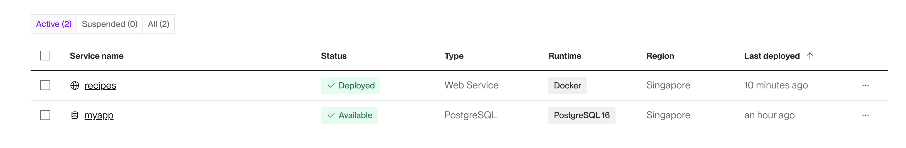

# Recipes REST API Example

This repository contains REST APIs for adding, updating, fetching, and deleting recipes. It uses SQLite (locally) and postgres(deployed version) for persistent data storage.

#### Tech Stack:

- **Web framework:** Flask
- **ORM:** SQLAlchemy
- **Database:** SQLite (Local), PostgreSQL (Deployed version)
- **Containerization:** Docker
- **Documentation:** Swagger-UI

#### Features:

- Containerized Docker setup for both APIs and the database.
- Separate configurations for Development, Testing, and Production environments using environment variables.
- RESTful API documentation via Swagger and visualization with Swagger UI.
- Simple to create different API versions in the future if needed.
- Validation with Marshmallow schema.
- Database entities integrated with SQLAlchemy.

## Contents

- [Getting Started](#getting-started)
- [Key Points](#key-points)
- [RESTful Endpoints](#restful-endpoints)
- [Documentation](#documentation)

## Getting Started

#### Requirements

- Docker
- Additional dependencies listed in `requirements.txt`

Get Docker: https://docs.docker.com/get-docker/

#### Running Locally

- It's recommended to create a virtual environment:
  ```sh
  python3 -m venv .venv
  ```
- Install dependencies:
  ```sh
  pip install -r requirements.txt
  ```
- Run the application:
  ```sh
  flask run
  ```
  Access the APIs at: http://127.0.0.1:5000

#### Running with Docker Locally

- Build and run the Docker containers:
  ```sh
  docker compose up
  ```

#### Database

- The `models` folder contains the schema for the recipes table.
- If `DATABASE_URL` is not provided in the environment file, the application defaults to SQLite, creating `data.db` in the `instance` directory when the program is run.
- If `DATABASE_URL` is provided, the application uses PostgreSQL.

## Key Points

- Flask framework is used for designing REST APIs. 
- Validation are performed using marshmellow schemas. Schema for all endpoints request/response are defined in `schemas.py`.
- Blueprint is used for organizing modular components, grouping routes. 
- SQLAlchamy is used as ORM for DB integration with SQLite and postgres. 
- Application and DB are running in separate containers in deployed version. Both components are deployed in render. 



## RESTful Endpoints

- `GET /recipes/<string:id>` - Returns a recipe for a given ID.
- `PATCH /recipes/<string:id>` - Updates a recipe.
- `DELETE /recipes/<string:id>` - Deletes a recipe.
- `GET /recipes` - Returns a list of recipes.
- `POST /recipes` - Creates a recipe with a valid payload.

#### Authentication

- All APIs are public; no authentication is implemented as per requirements.

## Documentation

- After running the application locally, API specifications can be viewed at: http://127.0.0.1:5000/recipes-api-specification